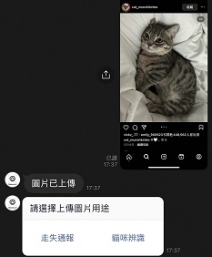
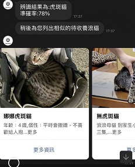

# AI辨識領養系統

## 項目簡介:
用戶在linebot上傳一張想領養的貓咪類型圖片,透過ai相似度辨識,自動查找領養資料庫中最相似的3筆貓咪資料,
並回傳相關領養資訊給用戶,減少飼主查詢資料的時間,方便又快速的服務期望能提高領養意願,增加領養率!

## 使用方式:
開啟linebot選單,點選我要領養,上傳一張圖片,點選貓咪辨識,得到回傳領養資訊

 

## 實作及相關細節:
此專案部署在GCP雲端上,共3台VM主機,彼此之間用API串接
- LineBot主程式
- ResNet50辨識模型
- MongoDB資料庫

> LineBot: 使用FLASK輕量框架,搭配UWISGI SERVER以及NGINX部署
>
> ResNet50: 使用PYTORCH架構,訓練資料共5000張,透過數據增強及模型可視化評估,最終準確率達95.83%
>
> MongoDB: 利用爬蟲爬取多個領養網站資訊,總資料筆數達上千筆,並依照貓咪資訊匯入資料庫

